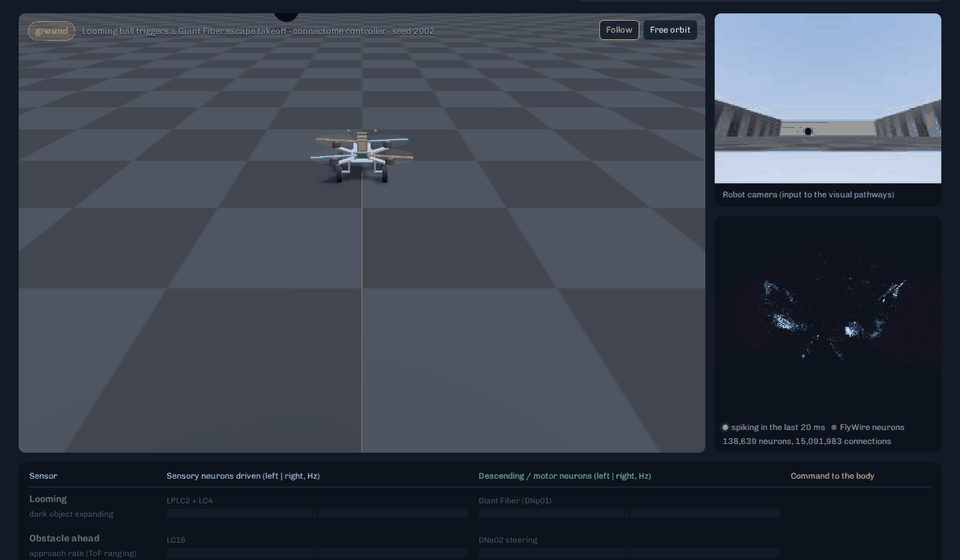
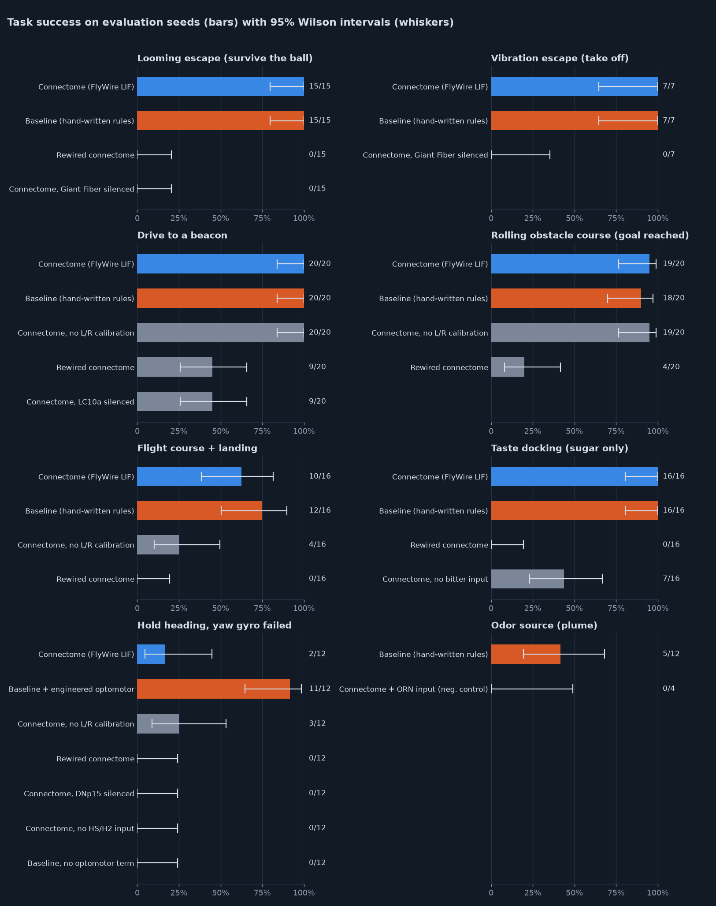
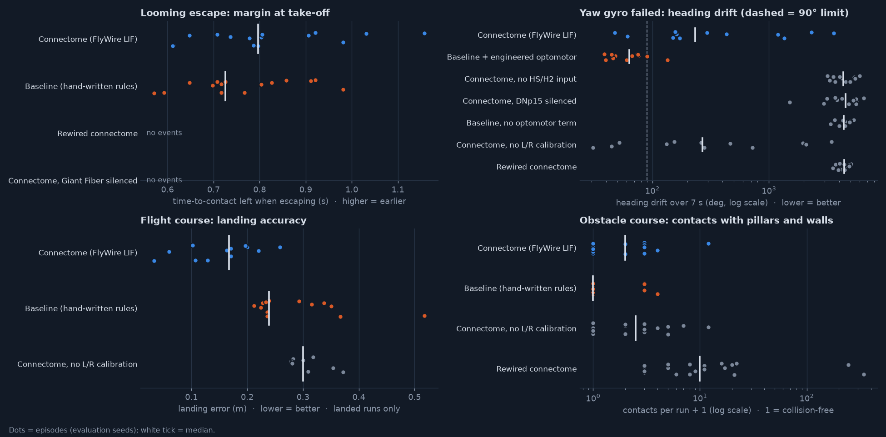
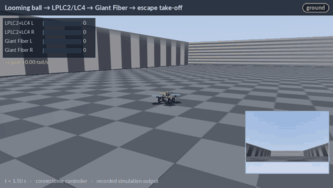
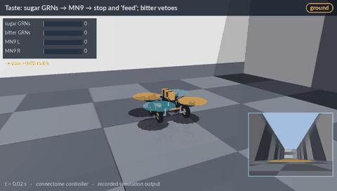
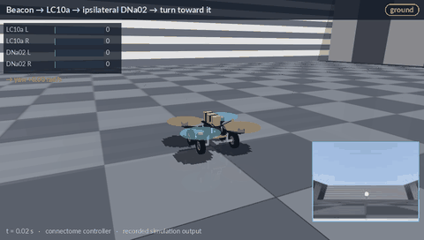
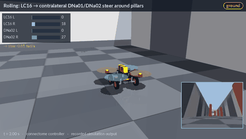
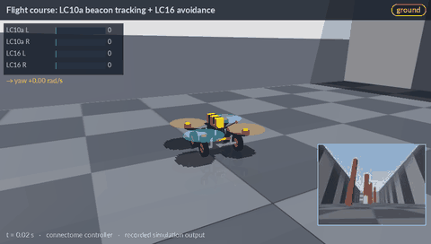
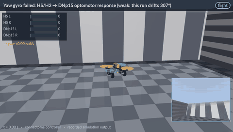
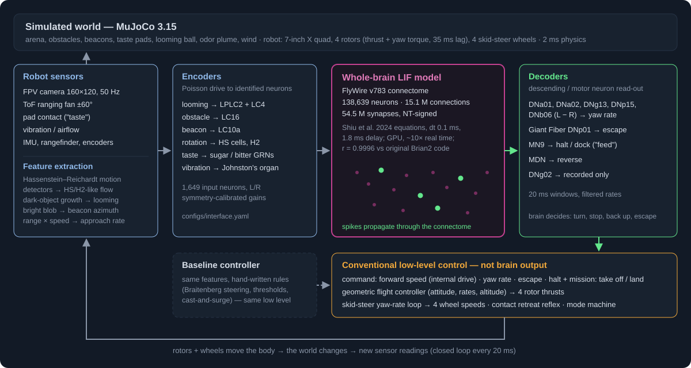

# Connectocopter

**Can a fruit-fly connectome control a robot?** Here, a spiking model of the
entire *Drosophila* brain (the FlyWire connectome, **138,639 neurons and
15.1 million connections**) reads the sensors of a simulated FPV quadcopter
that can also roll on four wheels, and drives it in closed loop. It escapes
looming objects, steers to beacons and around pillars, flies a course and
lands, and stops to "feed" on sugar but not on bitter.



*Browser viewer replaying a recorded run: the robot (left), its camera
(top right), the brain's spiking neurons at their FlyWire positions
(bottom right), and the sensory and descending neurons involved, with live
firing rates. Every frame is recorded simulation output.*
**[Open the viewer in your browser →](https://thejustas228.github.io/connectocopter/)**

> **What this is not.** It is not an uploaded fly, and it is not a complete or
> validated fly brain. The brain is the connectome-constrained
> leaky-integrate-and-fire model of Shiu et al. (2024, *Nature*), which its
> authors validated for feeding and grooming circuits. It runs unchanged, with
> no training. The brain decides *when* to escape, turn, stop or reverse, by
> reading identified descending neurons. A conventional flight and drive
> controller turns those decisions into rotor thrusts and wheel speeds. That
> split is clearly marked everywhere ([docs/brain_interface.md](docs/brain_interface.md)).

## Results

The results below are all **measured** in simulation on evaluation seeds
never used for tuning. No hardware was built or flown.

| Task | Connectome | Hand-written baseline | Decisive ablation of the connectome |
|---|---|---|---|
| Escape a looming ball (take off) | **15/15** · 0 false escapes in 15 catch trials | 15/15 · 0/15 | Giant Fiber (2 neurons) silenced: **0/15** |
| Escape a vibration (take off) | **7/7** | 7/7 | Giant Fiber silenced: **0/7** |
| Drive to a beacon | **20/20** | 20/20 | LC10a silenced: **9/20** (= driving straight) |
| Rolling obstacle course: goal reached | **19/20** | 18/20 | Rewired connectome: 4/20 |
| … without touching anything | 9/20 | **16/20** | Rewired: 0/20 |
| Flight course and landing, no contact | **10/16** | 12/16 | No left/right calibration: 4/16; rewired: 0/16 |
| Stop on sugar, not on bitter or mixed | **16/16** | 16/16 | No bitter input: **7/16** (it "feeds" on sugar+bitter) |
| Hold heading with a failed yaw gyro (optic flow only) | 2/12 | **11/12** (engineered optomotor) | DNp15 silenced or no HS/H2 input: 0/12 |
| Find an odor source | — (model's olfaction is unstable) | 5/12 | Connectome + olfactory input: 0/4 |



What this shows (details, intervals and every metric in
[docs/experiments.md](docs/experiments.md)):

- **The wiring matters.** A *rewired* connectome fails almost everything:
  0/15 escapes, 0/16 docks, 0/16 flights. It has the same neurons, the same
  number of synapses per neuron and the same excitatory/inhibitory balance;
  only the partners are shuffled.
- **Identified neurons are necessary for their behaviours.** Silencing the
  two Giant Fiber neurons abolishes every escape. Silencing LC10a turns
  beacon seeking into driving straight ahead: the 9 successes are exactly
  the seeds with the beacon dead ahead. Without bitter input the robot stops
  on the sugar+bitter pad, the bitter veto that Shiu et al. predicted for the
  fly. Optic-flow stabilisation runs through HS/H2 → DNp15.
- **It is not a better controller than simple rules.** The connectome matches
  the baseline on five tasks. It touches obstacles more often (collision-free
  9/20 vs 16/20). It is much weaker at optic-flow yaw stabilisation (2/12 vs
  11/12), and it computes at about real time, against 1.4–2x for the
  baseline. It does escape a little earlier and lands closer to the pad.
- **Negative finding:** any olfactory, thermo- or hygrosensory input drives
  the model into a self-sustaining runaway state of 8,000–10,000 neurons, so odor
  tracking is shown with the baseline only.



## Watch it

All clips are rendered from recorded simulation runs (seeds 2001+), with
the connectome in control.

| Ground | |
|---|---|
|  |  |
| Black ball → LPLC2/LC4 → Giant Fiber spike → escape take-off | Sugar GRNs → MN9 → stop and "feed"; bitter vetoes it |
|  |  |
| Beacon → LC10a → ipsilateral DNa02 → turn toward it | ToF approach rate → LC16 → contralateral DNa01/DNa02 → steer away |

| Flight | |
|---|---|
|  |  |
| Take off (mission), steer through pillars to the beacon (brain), land (mission) | Yaw gyro failed: HS/H2 → DNp15 optomotor response. This run *fails* (307° drift), as do 10/12 evaluation runs |

MP4 versions are in [docs/media/](docs/media/). The viewer also has
screenshots: [looming](docs/img/viewer_looming.png),
[taste](docs/img/viewer_taste.png), [flight](docs/img/viewer_flight.png)
and [obstacles](docs/img/viewer_obstacle.png).

## How the brain is connected to the robot



1. **Sensors → features.** The robot has an FPV camera processed as a 40×30
   "compound eye" with Hassenstein–Reichardt motion detectors, a forward
   time-of-flight ranging fan, an IMU, wheel odometry, a floor "taste" sensor
   and a vibration sensor.
2. **Features → identified neurons.** Each feature becomes Poisson spike
   input to a named FlyWire population, left and right separately: looming →
   LPLC2 + LC4; approach rate → LC16; beacon → LC10a; rotation → HS and H2;
   sugar and bitter → gustatory receptor neurons; vibration → Johnston's
   organ.
3. **Whole brain.** All 138,639 neurons are simulated every 0.1 ms. It is an
   exact GPU re-implementation of the Shiu et al. model, validated against
   the original Brian2 code (Pearson r = 0.9991–0.9999 on per-neuron rates),
   and runs ~10x faster than real time on an RTX 3070.
4. **Descending neurons → commands.** The Giant Fiber (DNp01) triggers
   escape. The left–right difference of DNa01, DNa02, DNg13, DNp15 and DNb06
   sets the yaw rate. MN9 means halt and "feed"; MDN means reverse.
5. **Commands → body.** A geometric flight controller (in the air) or a
   skid-steer loop (on the ground) executes the command. A contact-retreat
   reflex, the same for all controllers, backs off after a bump.

Which senses and behaviours are directly represented, functionally
approximated or not implemented:
[docs/capability_matrix.md](docs/capability_matrix.md). Every encoder and
decoder, with its evidence: [configs/interface.yaml](configs/interface.yaml).

## Quick start

Requires Python ≥ 3.10 and Linux (tested on Ubuntu 24.04 under WSL2). An
NVIDIA GPU is strongly recommended for the brain; it falls back to a CPU
path that is far slower. The baseline controller runs anywhere.

```bash
git clone https://github.com/TheJustas228/connectocopter && cd connectocopter
python -m venv .venv && source .venv/bin/activate     # or: uv venv && source .venv/bin/activate
pip install -e ".[dev]"                               # PyPI torch on Linux includes CUDA
python scripts/download_data.py                       # FlyWire v783 data (~130 MB), checksummed
python -m pytest tests/                               # engine tests (GPU tests skip without CUDA)

connectocopter tasks                                  # list the 8 tasks
connectocopter run looming_escape --controller connectome --seed 2002 --record
connectocopter run obstacle_course --controller baseline
connectocopter serve                                  # viewer + live simulations: http://127.0.0.1:8765
```

`--record` adds the episode to the viewer's list. In `serve` mode the viewer
can also start new simulations live on your machine. Offscreen rendering
uses EGL on Linux, or GLFW with Mesa llvmpipe through WSLg on WSL2, chosen
automatically.

## Reproducing every number

| What | Command | Output |
|---|---|---|
| Benchmarks (seeds ≥ 1000, all controllers and ablations) | `python scripts/run_benchmarks.py --workers 2` then `--summarize` | `results/benchmarks/` |
| Figures | `python scripts/make_figures.py` | `docs/img/results_*.png` |
| Brain engine vs original Brian2 code (needs `download_data.py --with-630`; Brian2 side takes CPU hours and ~3–6 GB RAM per worker) | `python scripts/validate_against_brian2.py --port --brian2 --compare` | `results/validation/` |
| Pathway atlas (what each sense drives in the model) | `python scripts/probe_pathways.py` | `results/pathways/` |
| Wheel-actuator sensitivity | `python scripts/sensitivity_wheels.py` | `results/sensitivity_wheels.json` |
| Hardware feasibility | `python scripts/feasibility.py` | `docs/hardware.md`, `results/feasibility.json` |
| Showcase replays, clips and viewer captures | `scripts/record_showcase.py`, `make_media.py`, `capture_viewer.py` | `web/replays/`, `docs/img/`, `docs/media/` |

Episodes are deterministic for a given seed and GPU. Tuning used seeds
0–99 only. Abandoned or buggy evaluation runs are kept in
[results/benchmarks/superseded/](results/benchmarks/superseded/).

## A real robot? (estimates, not built)

[docs/hardware.md](docs/hardware.md) has a priced bill of materials (real
parts with links, prices checked 2026-10-08) for a 7-inch quadcopter with
four wheel gearmotors and a Jetson Orin NX companion computer. These are
**estimates** from manufacturer data, not measurements:

- all-up weight 1.11 kg, thrust-to-weight 10
- ~10 min hover or ~78 min rolling on a 6S 2200 mAh LiPo
- ~$1,900 in parts

The brain on an Orin NX is estimated at ~2.6x real time (scaled by memory
bandwidth, not measured). This project is simulation only: nothing was
bought, built or flown.

## Status labels used in this repository

- **Measured:** produced by code in this repo and stored in `results/` (all task results, validation, speed on the RTX 3070).
- **Estimated:** computed from datasheets or scaling arguments (hardware mass, power, flight time, cost, Orin NX speed).
- **Future work:** not done. Retinotopic visual input, a learned optic-lobe front end (e.g. flyvis), the ventral nerve cord (MaleCNS/BANC), short-term synaptic plasticity to tame the olfactory runaway, and hardware.

## Documentation

| | |
|---|---|
| [docs/brain_interface.md](docs/brain_interface.md) | The brain model, GPU engine, validation, pathway atlas, encoders, decoders, findings |
| [docs/experiments.md](docs/experiments.md) | Tasks, protocol, full results and ablations |
| [docs/capability_matrix.md](docs/capability_matrix.md) | Fly capability → robot capability, with status labels |
| [docs/robot.md](docs/robot.md) | Robot body, modes, physics and rendering |
| [docs/hardware.md](docs/hardware.md) | Bill of materials and feasibility (estimates) |
| [docs/limitations.md](docs/limitations.md) | What this does not show |
| [docs/decisions.md](docs/decisions.md) | Decision log |
| [docs/sources.md](docs/sources.md) | Research log: papers, preprints, datasets, demos |
| [docs/licenses.md](docs/licenses.md) | Licenses and attribution |

## Credits and licenses

Code: MIT ([LICENSE](LICENSE)). This project builds on:

- **FlyWire connectome:** Dorkenwald et al. 2024 and Schlegel et al. 2024, *Nature*; data CC-BY 4.0. It is downloaded by `scripts/download_data.py`, not redistributed. The viewer ships neuron positions derived from it, with attribution.
- **Whole-brain LIF model:** Shiu et al. 2024, *Nature*, "A Drosophila computational brain model reveals sensorimotor processing", re-implemented here.
- **Neurotransmitter predictions:** Eckstein et al. 2024, *Cell*.
- **Physics:** MuJoCo (Apache-2.0). **Viewer:** three.js (MIT).

Full attributions: [docs/licenses.md](docs/licenses.md) and [docs/sources.md](docs/sources.md).
