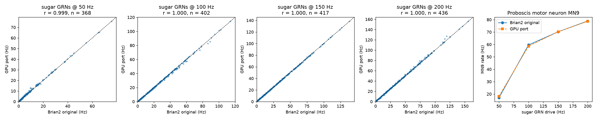

# The brain and the brain–body interface

This document is the technical record of *what the "fly brain" in Connectocopter is*, how it is connected to the robot, and what was found along the way. Every number here comes from the scripts named next to it.

## 1. What the brain is (and is not)

| | |
|---|---|
| Connectome | FlyWire adult female *Drosophila* brain, public materialization **v783** (Dorkenwald et al. 2024; Schlegel et al. 2024), as packaged by Shiu et al. (2024) in `Connectivity_783.parquet` / `Completeness_783.csv` |
| Neurons simulated | **138,639** (all proofread neurons in the v783 completeness list — the whole brain incl. optic lobes; no reduction) |
| Connections | **15,091,983** pre→post neuron pairs (9,059,302 excitatory, 6,032,681 inhibitory) |
| Synapses | **54,492,922** (32.5 M in excitatory, 22.0 M in inhibitory connections) |
| Synapse sign | from predicted neurotransmitter (Eckstein et al. 2024): acetylcholine → excitatory; GABA and glutamate → inhibitory (as in Shiu et al.) |
| Neuron model | leaky integrate-and-fire with exponential synaptic conductance, identical for every neuron (Shiu et al. 2024) |
| Free parameters | one: `w_syn = 0.275 mV` per synapse, chosen by Shiu et al. so that sugar GRNs at 100 Hz drive MN9 to ~80% of its maximum |
| Not modelled | gap junctions, neuromodulators/neuropeptides, plasticity/learning, internal state, non-spiking/graded neurons, morphology, receptor kinetics, the ventral nerve cord (VNC) and the body's own sensory neurons below the neck |

It is therefore a **connectome-constrained spiking model of the whole central brain**, validated by Shiu et al. for gustatory (feeding) and antennal-grooming sensorimotor pathways (91% of 164 tested predictions). It is *not* a validated model of fly behaviour in general, and Connectocopter does not claim that it is a complete, functioning fly brain.

### Equations (Shiu et al. 2024; implemented in `connectocopter/brain/lif.py`)

```
dv/dt = (v_0 - v + g) / t_mbr          (unless refractory)
dg/dt = -g / tau                       (unless refractory)
v > v_th  ->  spike;  v = v_rst,  g = 0,  refractory for t_rfc
presynaptic spike  ->  g_post += w_syn * (signed synapse count)  after t_dly

v_0 = v_rst = -52 mV   v_th = -45 mV   t_mbr = 20 ms   tau = 5 ms
t_rfc = 2.2 ms         t_dly = 1.8 ms  w_syn = 0.275 mV   dt = 0.1 ms (exact linear integration)
```

Sensory input ("activation") is a Poisson process per input neuron adding `250 × w_syn = 68.75 mV` to `v` (enough to force a spike), exactly as in the original `PoissonInput`; driven neurons have no refractory period. Input arriving while a neuron is refractory is discarded (Brian2's conditional-write semantics for `(unless refractory)` variables).

### GPU implementation

The original runs in Brian2 on CPUs (minutes per simulated second; ~3 GB RAM per worker). Connectocopter re-implements it in PyTorch + Triton:

- Because every synapse has the same 1.8 ms delay (18 steps), spikes produced inside an 18-step block cannot affect that block. Each block is one fused kernel that advances all neurons 18 steps, plus one event-driven kernel that scatters each spike's outgoing synapses into a ring buffer 18 steps ahead. This is an exact reordering of the per-step algorithm, not an approximation.
- Synaptic input is accumulated as integer synapse counts in float32 — exact in any summation order — so runs are **bit-reproducible** for a given seed (`tests/test_lif.py::test_seed_determinism`), and the GPU kernels match the plain-PyTorch reference path bit-for-bit (`test_gpu_matches_cpu_reference_bit_exact`).
- Speed (RTX 3070, measured): **0.16 ms per 1.8 ms block → ~10x real time** for the full brain at batch 1; ~13 simulated brain-seconds per wall-second when batching 8–30 trials.

### Validation against the original Brian2 code (`scripts/validate_against_brian2.py`)

The unmodified `model.py` of Shiu et al. (pinned commit) and the GPU port were run on the same experiment as the paper's Fig. 1: Poisson activation of the 21 right-hemisphere sugar GRNs (FlyWire v630), 30 trials × 1 s.

| Drive | Pearson r of per-neuron rates (all non-driven neurons) | Jaccard of active sets (≥1 Hz) | MN9 rate: Brian2 → port |
|---|---|---|---|
| 50 Hz | **0.9991** | 0.96 | 16.98 → 18.15 Hz |
| 100 Hz | **0.9996** | 0.98 | 59.62 → 58.65 Hz |
| 150 Hz | **0.9999** | 0.99 | 70.22 → 70.25 Hz |
| 200 Hz | **0.9997** | 1.00 | 78.93 → 78.70 Hz |

(Each Brian2 condition costs ~30–60 CPU-minutes and 3–8 GB RAM, peaking at 7.6 GB at 200 Hz; the port needs ~5 s on the GPU for all 30 trials.)



This validation **caught a real bug**: an earlier version of the port let synaptic input accumulate during the refractory period, inflating rates at high drive (+11% at MN9). All results in this repository were regenerated after the fix (commit `abab370`).

## 2. Pathway atlas: what the brain does with each sense

Before connecting anything to the robot, each candidate sensory population was activated *in silico* (Poisson 100 Hz, 8 trials × 1 s, left and right separately) and every descending (DN) and motor neuron was recorded (`scripts/probe_pathways.py` → `results/pathways/atlas.md`). Highlights:

| Sensory population (FlyWire type) | Strongest DN/motor responses | Use in the robot |
|---|---|---|
| LPLC2, LC4 (looming detectors) | **DNp01 (Giant Fiber)** 94–134 Hz, DNp04, DNp02, DNp11, DNp103 | escape take-off |
| LC16 (frontal looming) | **contralateral** DNa01/DNa02/DNa13 | turn away from obstacles |
| LC10a (small moving objects) | **ipsilateral** DNa02, DNae002, DNa06 | turn toward a target |
| HS cells (front-to-back flow) | ipsilateral **DNp15 (DNHS1)**, DNa02 | optomotor yaw stabilisation |
| H2 (back-to-front flow) | **contralateral DNp15** | optomotor yaw stabilisation |
| sugar GRNs | MN9 (CB0701), CB0700, DNge059 | stop and "feed" (dock) |
| bitter GRNs | weak; suppresses sugar → MN9 | veto docking |
| Johnston's organ A/B (sound) | DNp01 (Giant Fiber, right side), DNg29 | escape take-off |
| Johnston's organ C/E (wind) | DNb06, DNbe001, DNp18/19 | encoded, but no benchmark task has ambient wind (input stays near 0 Hz) |
| **any olfactory receptor neuron class, thermo- or hygrosensory neuron** | **runaway: ~8,100–10,300 neurons active, identical output regardless of input** | **not usable — see §5** |

These pathways agree with the experimental literature (citations in `configs/interface.yaml` and `docs/sources.md`): LPLC2/LC4 → Giant Fiber (von Reyn et al. 2017; Ache et al. 2019); LC10a in object pursuit (Ribeiro et al. 2018); LC16 avoidance (Wu et al. 2016); HS + contralateral H2 → DNp15 (Suver et al. 2016; Erginkaya et al. 2025); sugar → MN9 and bitter suppression (Shiu et al. 2024); JO → Giant Fiber (Lehnert et al. 2013 — air-puff/sound input to the GF).

## 3. Sensors → neurons (encoders)

Every mapping lives in **`configs/interface.yaml`**. A sensor feature `f` becomes Poisson drive to every neuron of an identified FlyWire population:

`rate = max_hz × clip(side_gain × (f − offset) / scale, 0, 1)`

| Encoder | FlyWire population (v783) | Neurons | Robot feature (source) | Fidelity |
|---|---|---|---|---|
| looming_L / R | LPLC2 + LC4, left / right | 162 / 152 | relative growth rate of dark objects per hemifield (FPV camera, `vision.py`) | functionally approximated |
| obstacle_L / R | LC16, left / right | 77 / 74 | approach rate ≈ 1/time-to-contact from a 50-ray ToF fan × odometry speed (`suite.py`) | functionally approximated (fly uses motion parallax; robot uses ranging) |
| target_L / R | LC10a, left / right | 115 / 119 | bright-beacon presence × azimuth (camera) | functionally approximated |
| yawflow_HS_L / R | HSN + HSE + HSS, left / right | 3 / 3 | front-to-back horizontal motion per hemifield from Hassenstein–Reichardt correlators | functionally approximated (EMD is the canonical model of T4/T5) |
| yawflow_H2_L / R | H2, left / right | 1 / 1 | back-to-front horizontal motion per hemifield | functionally approximated |
| vibration_L / R | Johnston's organ auditory (JO-A/B), left / right | 212 / 175 | vibration / sound event amplitude (task-generated) | functionally approximated |
| wind_L / R | Johnston's organ wind/gravity (JO-C/E), left / right | 249 / 232 | apparent airflow at the antennae | functionally approximated; connected in every task, but no task has ambient wind, so it stays near 0 Hz (max 5.4 Hz, in 6% of flight frames, in the recorded episodes) |
| taste_sugar | sugar GRNs (both sides) | 32 | robot standing on a sugar pad (contact sensor) | directly represented (identified neurons, validated pathway); sensor is abstract |
| taste_bitter | bitter GRNs | 42 | robot standing on a bitter pad | directly represented (identified neurons); sensor is abstract |

In total 1,649 input neurons (1.2% of the brain) receive drive; everything else is driven only by the connectome.

**Left/right symmetry calibration.** FlyWire is one individual and is not bilaterally symmetric. With equal drive to LC16-left and LC16-right, the brain's steering output was +19 Hz to the left; with equal forward optic flow, +8.5 Hz. `ConnectomeController.calibrate_symmetry()` finds, by bisection, a per-side gain ratio for each bilateral input pair so that symmetric stimulation gives zero mean steering — the equivalent of calibrating sensor biases. Calibrated gains (cached in `results/calibration/`) range 0.72–1.39. The uncalibrated brain is evaluated as an ablation. Calibration removes the *bias*, but not the *gain* asymmetry: an obstacle on the right still produces a much stronger avoidance signal than one on the left (+25.6 vs −4.0 Hz steering in the test of §4 of `docs/decisions.md`).

## 4. Neurons → actions (decoders)

Spikes of identified descending/motor neurons are counted every 20 ms control step and filtered (τ = 60 ms; 120 ms for the single-cell steering DNs).

| Command | Read-out neurons | Rule | Evidence |
|---|---|---|---|
| yaw rate | DNa02 (w 1.0), DNa01 (0.6), DNg13 (0.6), **DNp15 (1.0)** ipsiversive; DNb06 (0.6) contraversive | `yaw = gain × tanh(Σ w (L − R) / 40 Hz)`, gain 1.6 rad/s on the ground, 1.2 in flight | Yang et al. 2024; Rayshubskiy et al. 2025; Erginkaya et al. 2025 |
| escape / take-off | DNp01 Giant Fiber (L, R) | ≥ 1 spike in a 20 ms step → escape take-off (or escape climb when flying) | von Reyn et al. 2014 (one GF spike triggers the short-mode escape) |
| reverse | MDN (2 per side) | backward speed 0.6 m/s × rate/60 Hz | Bidaye et al. 2014 |
| halt ("feed", dock) | MN9 = CB0701 (L, R) | stop while MN9 > 15 Hz | Shiu et al. 2024 |
| — (recorded only) | DNg02 population (25 cells) | none of our inputs drives it | Namiki et al. 2022 |

**What the brain does *not* decide.** The LIF model sits at 0 Hz without input, so it has no spontaneous drive to move. A constant *internal drive* (cruise speed 0.8 m/s rolling, 1.2 m/s flying) is supplied from outside and the brain modulates it (halt, reverse, turn, escape). Altitude, attitude, rotor thrusts and wheel speeds come from a conventional flight/drive controller (`connectocopter/robot/robot.py`): a geometric attitude controller (Lee et al. 2010) and a skid-steer yaw-rate loop, plus a contact retreat reflex (back up for 0.7 s on touching an obstacle — the analogue of a local VNC reflex). Mission-level events (take off at the start of the flight course, land at the beacon) are issued by the task and logged as such. The baseline controller uses exactly the same low-level layer.

**Efference copy.** Flies suppress motion-vision feedback during self-generated course-changing turns (Kim et al. 2015, 2017; Fenk et al. 2021). The interface implements this as an option (HS/H2 drive suppressed during decoder saccades). Because the saccade generator is disabled in the final configuration (below), it is inactive in the benchmarks.

## 5. Findings about the model

1. **The olfactory system of the LIF model is unstable.** Activating any olfactory receptor neuron class — or a *single* projection neuron at 50 Hz, or ORNs at only 5 Hz — ignites a brain-wide state of ~8,100–10,300 active neurons (≈3,500 Kenyon cells, all antennal-lobe projection and local neurons, lateral horn) that **persists after the input is removed** and produces the same descending output (DNb05 ≈ 200–330 Hz bilaterally, DNge037, DNg35) regardless of which odour channel was driven. Removing ORN→ORN or KC→KC synapses does not prevent it. Thermo- and hygrosensory neurons (which enter the same antennal lobe) trigger the same attractor. The likely cause is the absence of short-term synaptic depression, adaptation and neuromodulation in a strongly recurrent excitatory circuit; Shiu et al. validated gustatory and mechanosensory pathways, not olfaction. Consequently **odour-guided navigation is not implemented through the connectome**; the odor-plume task is run with the baseline controller, and the connectome with ORN inputs is reported as a negative control.
2. **Walking-steering DNs do not receive the optic-flow pathway; DNp15 does.** HS/H2 input barely moves DNa01/DNa02 in this model, and H2 even pushes them in the destabilising direction. Reading out DNp15 (DNHS1), which integrates ipsilateral HS and contralateral H2 exactly as described by Erginkaya et al. (2025), produced a working optomotor loop.
3. **Steering signals are noisy and asymmetric.** Each steering DN type is a single cell per side, so 20 ms spike counts are noisy; LC16-right → DNa02-left is several times stronger than the mirror pathway.
4. **A saccade generator on the decoder made things worse.** An integrate-to-threshold "saccade" layer (inspired by fly body saccades) was triggered by DN noise; with it, the flight course failed on 4/4 tuning seeds, without it 3/4 succeeded. It is disabled by default and kept only as an option.

## 6. Closed-loop timing and compute

- Control period 20 ms: features → Poisson rates → 20 ms of brain (11 blocks) → decoded command → 10 physics steps of 2 ms.
- The brain's sensory-to-descending latency is a few synaptic delays (≥ 1.8 ms each) plus integration; LPLC2 → Giant Fiber responds within one 20 ms step.
- Closed loop with rendering on one RTX 3070 + llvmpipe camera rendering: 0.9–1.2x real time for the connectome controller (median per task in `results/benchmarks/summary.md`; measured with other jobs running).

## 7. Reproducing everything in this document

```bash
python scripts/download_data.py --with-630        # data (CC-BY 4.0, not redistributed)
python -m pytest tests/test_lif.py                # engine tests
python scripts/validate_against_brian2.py --port --compare   # GPU side (Brian2 side: --brian2, CPU hours)
python scripts/probe_pathways.py                  # pathway atlas
```
