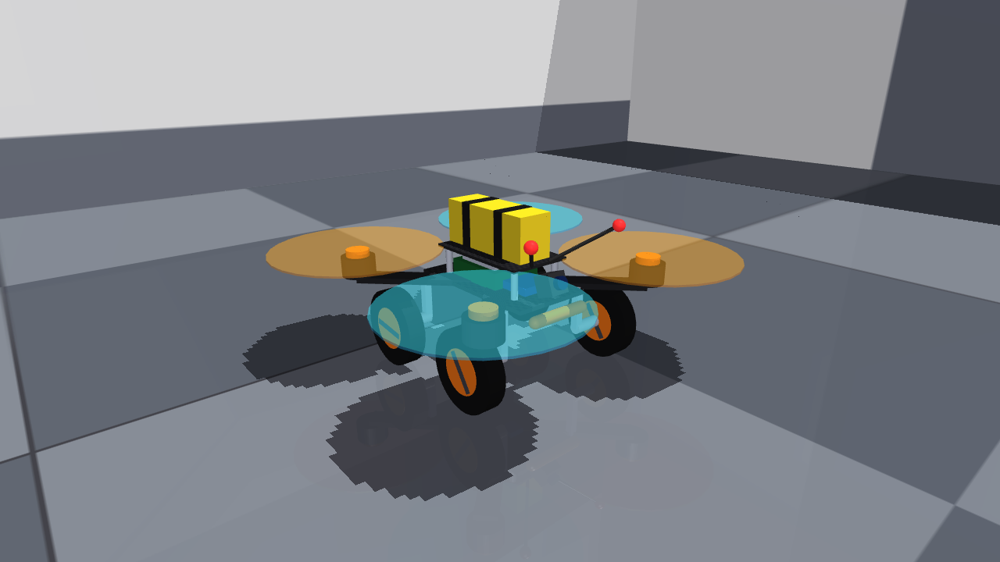

# The robot: a 7-inch FPV quadcopter that also rolls

The simulated robot is generated as MJCF by `connectocopter/robot/model.py`; the browser viewer draws the same geoms (exported from the compiled MuJoCo model by `scripts/export_web_assets.py`).



## Layout

| Item | Simulated value | Proposed hardware (docs/hardware.md) |
|---|---|---|
| Frame | X frame, 295 mm motor-to-motor diagonal, carbon plates + 4 arms | iFlight Chimera7 Pro V2 (327 mm, 7.5") |
| Mass | **1.171 kg** all-up (sum of per-component masses below) | ~1.11 kg |
| Propulsion | 4 rotors, 7" props (r = 89 mm), thrust limit 16 N each, first-order motor lag τ = 35 ms, reaction torque 0.012 N m per N of thrust | Hobbywing XRotor 2807 1300KV + HQ 7x4x3 on 6S (max 2.8 kgf each) |
| Spin directions | FL & RR spin one way, FR & RL the other (standard X) | — |
| Wheels | **4 independently driven wheels**, Ø 80 mm, on struts under the arms (track 176 mm, wheelbase 124 mm); velocity servo per wheel, 0.25 N m torque limit, 60 rad/s | 4 × Pololu 100:1 HPCB micro gearmotors + 80×10 mm wheels |
| Steering on the ground | **Skid steer**: left and right wheel pairs at different speeds; a gyro yaw-rate loop corrects slip | — |
| Battery | 330 g on top of the stack (typical FPV top-mount) | 6S 2200 mAh LiPo, 346 g |
| Compute | 115 g block in the stack (Jetson Orin NX + carrier + heatsink) | Jetson Orin NX 16GB on a WeAct N006 carrier |
| Camera | forward FPV camera, 20° up-tilt, 80° vertical / ~98° horizontal FOV, 160×120 px rendered at 50 Hz | Arducam OV9281 global shutter |
| Ranging | 50-ray ToF fan, ±60° azimuth, 0° and 10° elevation, 4 m | 3 × VL53L8CX |
| "Antennae" | two stalks with odor/airflow sensor tips, 11 cm apart | 2 × BME688 |
| Down sensors | rangefinder (altitude), contact/taste pad sensor | MTF-02 flow+range, AS7341 |
| IMU | gyro + accelerometer at the centre | flight controller IMU |

Mass breakdown in the model (kg): frame 0.205, motors+props 4 × 0.062, battery 0.330, compute 0.115, avionics (FC, ESC, receiver) 0.045, sensors 0.040, wheel units 4 × 0.034, wiring 0.040.

## Modes and transitions

```
           takeoff request (mission) or escape (Giant Fiber spike)
 GROUND ───────────────────────────────────────────────▶ TAKEOFF ──(altitude reached)──▶ FLIGHT
   ▲  wheels driven, rotors off                           rotors on, wheels stopped           │
   │                                                       climb 1 m/s (escape: 3 m/s,         │ land request
   │                                                       +1.5 m extra altitude)              ▼ (mission)
   └──────────────────── touchdown (altitude ≈ rest height, |v_z| < 0.25 m/s) ◀──────────── LANDING
                                                                                  descend 0.5 m/s
```

- **Rolling**: the rotors are off; the wheels carry the robot. The brain's forward-speed and yaw-rate commands become left/right wheel speeds (skid steer) with a gyro yaw-rate loop. A *contact retreat reflex* backs the robot up for 0.7 s, turning away from the contact side, whenever any part touches an obstacle.
- **Take-off from rolling**: wheels stop, rotors spin up, the flight controller climbs to the cruise altitude (1.2 m). An escape (Giant Fiber) take-off climbs at 3 m/s and overshoots by 1.5 m.
- **Flight**: a cascaded geometric controller (Lee et al. 2010) tracks the decision layer's forward speed and yaw rate, holds altitude from the downward rangefinder, and limits tilt to 30°.
- **Landing**: descend at 0.5 m/s; the wheels are the landing gear; on touchdown the rotors stop and the robot is a rover again.

## Physics model and its limits

- Rotor thrust and reaction torque at the motor sites; spin-up is a first-order filter on the commanded thrust.
- Rotor drag: horizontal damping proportional to total thrust (0.10 N per m/s per rotor at hover thrust).
- Body drag: MuJoCo inertia-box fluid model (air density 1.225 kg/m³).
- Wheels: hinge joints with velocity servos and a torque limit; tyre friction μ = 0.9 on the floor.
- State estimation for the flight controller: ground truth + Gaussian noise (velocity σ 0.03 m/s, attitude σ 0.5°, altitude σ 1 cm, gyro σ 0.01 rad/s), standing in for an EKF that fuses IMU, optical flow and rangefinder.
- **Not modelled**: blade flapping, ground effect, prop wash on the wheels and on the airflow sensors, battery voltage sag, motor heating, aerodynamic interaction between rotors, tyre deformation, sensor latency beyond the 20 ms control period.
- **Energy**: rotor power from momentum theory with figure of merit 0.6 and motor+ESC efficiency 0.8; this is ~30% lower than the motor manufacturer's measured power at hover thrust, so simulated flight energy is optimistic (docs/hardware.md uses the manufacturer data instead).

## Rendering

The robot's FPV camera is rendered by MuJoCo (GLFW on Mesa; on WSL2 the llvmpipe CPU rasteriser is 6–13x faster than the d3d12 GPU path for MuJoCo's many small draw calls) with shadows and reflections disabled, at 160×120 and 50 Hz. Showcase images are rendered with shadows at 720p.
